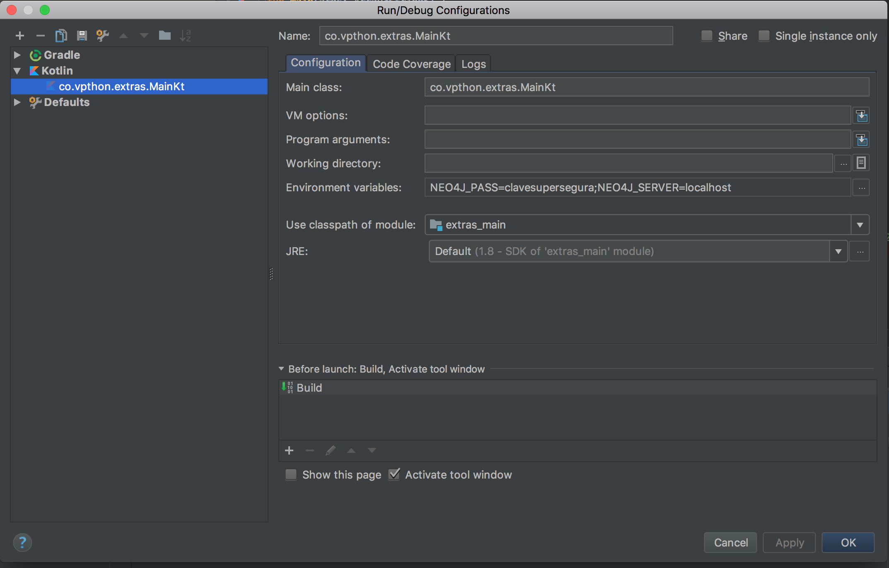

# extras_app_be



## Creating Constraints
```Cypher
CREATE CONSTRAINT ON (p:Person) ASSERT p.dni IS UNIQUE
```

## Loading data

### Persons

```Cypher
LOAD CSV WITH HEADERS FROM 
"https://raw.githubusercontent.com/pablobastidasv/extras_app_be/master/data/persons.csv"
AS row
CREATE (p:Person)
SET p = row
```

### Attributes

```Cypher
LOAD CSV WITH HEADERS FROM 
"https://raw.githubusercontent.com/pablobastidasv/extras_app_be/master/data/attributes.csv" 
AS row
CREATE (a:Attribute)
SET a = row
```

### Relations

```Cypher
LOAD CSV WITH HEADERS FROM 
"https://raw.githubusercontent.com/pablobastidasv/extras_app_be/master/data/dni_type_value.csv" 
AS row
match (p:Person), (a:Attribute)
WHERE row.dni = p.dni and row.type = a.type and row.value = a.value
create (p)-[:HAS]->(a)
```

## Running locally 

### with Heroku

You have to get a `neo4j` database running locally and the user and password should be the 
same you can find in `.env.heroku` file

```bash
heroku local -e .env.heroku
```

### with Docker

In this case docker runs every you need

```bash
docker-compose up
```

## Running `neo4j` DB with docker

```bash
docker-compose up -d neo4j
```
